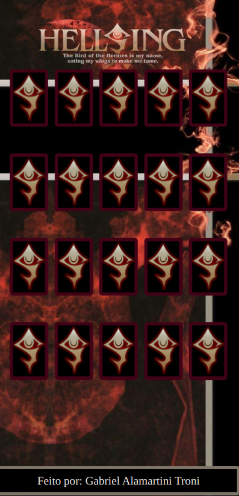
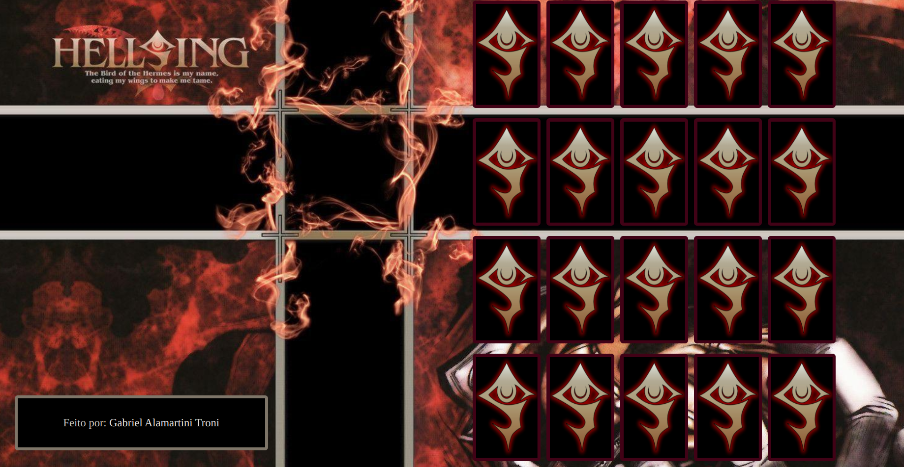

# Hellsing Ultimate's Memory Game
A memory game based on Hellsing Ultimate's animation and manga developed for a web environment.

## Technologies Used
- Javascript
- CSS
- HTML

## Features
- Randomly generate cards.
- Verify if two selected cards are equal and respond accordingly.
- Ensure responsiveness for different screen sizes.

## Screenshots

  
  

## Acknowledgements
A special thanks to Digital Innovation One (DIO) for hosting the bootcamp that included this project, and to instructor Gabriela Pinheiro for presenting the project.

